# ChainForge — Supply Chain Analytics Pipeline

> An end-to-end data engineering and analytics project built on **Azure Data Lake Gen2**, **Azure Data Factory**, and **Power BI** using the DataCo Supply Chain dataset (~180,000 records across 4 years, 53 columns).

---

## Table of Contents

- [Architecture Overview](#architecture-overview)
- [Tech Stack](#tech-stack)
- [Dataset](#dataset)
- [Azure Data Lake Structure](#azure-data-lake-structure)
- [Azure Data Factory Pipeline](#azure-data-factory-pipeline)
- [Data Flow Transformations](#data-flow-transformations)
- [Power BI Dashboard](#power-bi-dashboard)
- [Key DAX Measures](#key-dax-measures)
- [Key Insights](#key-insights)
- [Project Structure](#project-structure)
- [Setup & Reproduction](#setup--reproduction)
- [Author](#author)

---

## Architecture Overview

```
Azure Data Lake Gen2 — sourcesupplychaindataset/raw/
        ↓
Azure Data Factory — PL_SupplyChain_Master
   ├── Get Metadata Activity        (list all files in raw/)
   ├── ForEach — ForEachSourceFiles (loop through each file)
   ├── IF Condition                 (filter supplychain_* files only)
   ├── Copy raw files               (move to processed/ folder)
   └── Data Transformation (Data Flow)
       ├── 4 Sources (sourceCSV, sourceParquet, sourceAvro, sourceJson)
       ├── unionFiles               (merge all 4 into one stream)
       ├── selectColumns            (drop 10 unnecessary columns)
       ├── derivedColumn            (fix types, dates, names, prices, delivery)
       ├── aggregate                (deduplicate by Order Item Id + Customer Id)
       ├── alterRows                (apply insert/update rules)
       └── sink → output/supplychain_final.csv (7.36 MiB, 39 columns)
        ↓
Power BI — 6-page interactive dashboard
```

---

## Tech Stack

| Layer | Technology |
|---|---|
| Cloud Storage | Azure Data Lake Storage Gen2 |
| Orchestration | Azure Data Factory |
| Transformation | ADF Data Flow |
| Visualization | Power BI |
| Languages | Python, DAX |
| Python Libraries | pandas, pyarrow, pandavro |

---

## Dataset

- **Source:** DataCo Supply Chain Dataset (Kaggle)
- **Records:** ~180,000 orders
- **Years covered:** 2015, 2016, 2017, 2018
- **Raw columns:** 53
- **Final columns after cleanup:** 39

**File formats used per year:**

| Year | Format | Size |
|---|---|---|
| 2015 | CSV | 4.18 MiB |
| 2016 | Parquet | 702.4 KiB |
| 2017 | Avro | 3.56 MiB |
| 2018 | JSON | 389.14 KiB |

---

## Azure Data Lake Structure

**Storage Account:** `supplychainstorageadf`
**Container:** `sourcesupplychaindataset`

```
sourcesupplychaindataset/
├── raw/                              ← original uploaded files
│   ├── supplychain_2015.csv
│   ├── supplychain_2016.parquet
│   ├── supplychain_2017.avro
│   ├── DataCoSupplyChainDataset.csv
│   ├── DescriptionCoSupplyChain.csv
│   └── supplychain_2018.json
├── processed/                        ← copied by ADF pipeline
│   ├── supplychain_2015.csv
│   ├── supplychain_2016.parquet
│   ├── supplychain_2017.avro
│   └── supplychain_2018.json
└── output/                           ← final clean merged file
    └── supplychain_final.csv         (7.36 MiB)
```

### ADLS Containers
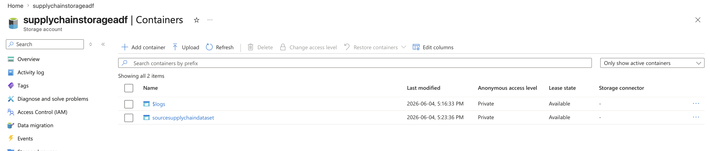

### Raw Folder
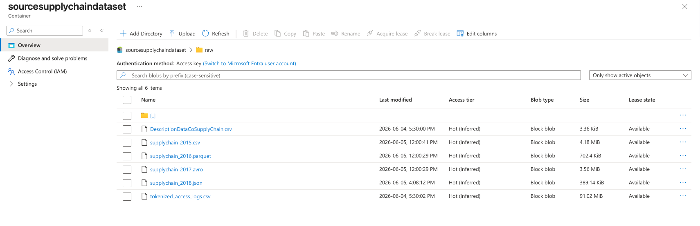

### Processed Folder
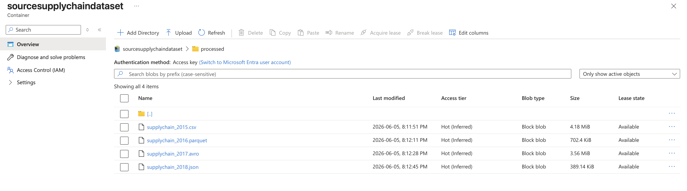

### Output Folder
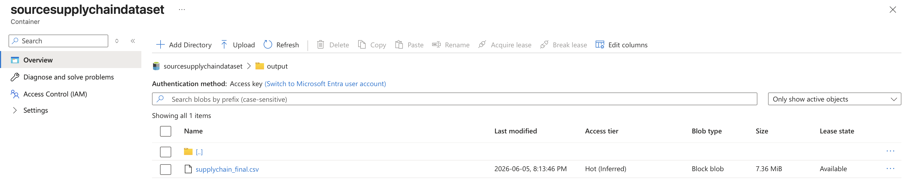

---

## Azure Data Factory Pipeline

### Pipeline: PL_SupplyChain_Master

**Activities:**

**1. Get Metadata**
- Dataset: Binary (points to `raw/` folder)
- Field list: `childItems`
- Returns list of all files in the container
- Duration: 5 seconds

**2. ForEach — ForEachSourceFiles**
- Items: `@activity('GetMetadata').output.childItems`
- Iterates over every file found in raw folder
- Duration: 1m 18s

**3. IF Condition — if starts with supplychain_**
- Expression: `@startsWith(item().name, 'supplychain_')`
- Filters only supply chain data files
- Skips unrelated files like `tokenized_access_logs.csv`

**4. Copy raw files**
- Reads each file in its native format (CSV, Parquet, Avro, JSON)
- Copies to `processed/` folder
- Duration: ~15-18 seconds per file

**5. Data Transformation (Data Flow)**
- Runs all transformation logic
- Duration: 1m 40s
- Integration Runtime: debugpool-8Cores-General (Canada Central)

### Pipeline Run — All Succeeded
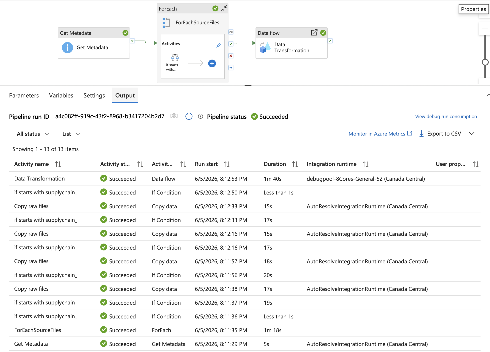

---

## Data Flow Transformations

### Data Flow: DF_SupplyChain

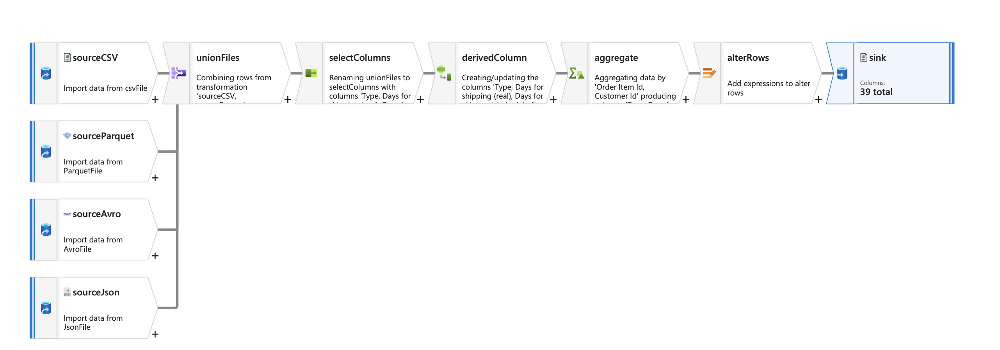

| Step | Transformation | Purpose |
|---|---|---|
| 1 | sourceCSV, sourceParquet, sourceAvro, sourceJson | Read all 4 processed files |
| 2 | unionFiles | Merge all 4 sources into a single stream (52 columns) |
| 3 | selectColumns | Drop 10 unnecessary columns (39 columns remaining) |
| 4 | derivedColumn | Fix data types, standardize dates, clean customer names, normalize delivery status, parse product prices |
| 5 | aggregate | Deduplicate rows using `Order Item Id` + `Customer Id` as composite key |
| 6 | alterRows | Apply insert/upsert rules before writing to sink |
| 7 | sink | Write clean merged data to `output/supplychain_final.csv` |

---

### Columns Dropped (selectColumns)

```
Customer Email        ← masked (xxxxxxx), no analytical value
Customer Password     ← masked (xxxxxxx), sensitive
Product Image         ← URL string, useless in analytics
Product Description   ← long text, no use in visualization
Customer Street       ← too granular
Customer Zipcode      ← too granular
Order Zipcode         ← too granular
Customer Id           ← redundant after dedup key setup
Order Id              ← redundant with Order Item Id
Order Department Id   ← Department Name kept instead
```

---

### Type Fixes (derivedColumn)

```
Late_delivery_risk         → toInteger()
Product Status             → toInteger()
Days for shipping (real)   → toInteger()
Order Zipcode              → toString()
Product Description        → toString()
```

---

### Date Standardization

Dates were corrupted with 6 mixed formats. Fixed using `coalesce()`:

```
coalesce(
    toDate({order date}, 'MM/dd/yyyy'),
    toDate({order date}, 'dd-MM-yyyy'),
    toDate({order date}, 'yyyy/MM/dd'),
    toDate({order date}, 'MMMM dd, yyyy'),
    toDate({order date}, 'dd MMM yyyy'),
    toDate({order date}, 'yyyyMMdd')
)
```

Applied to both `order date (DateOrders)` and `shipping date (DateOrders)`.

---

### Customer Name Cleanup

```
Removed salutations: MR. / MRS. / MS.
Applied initCap for proper title casing

Expression:
iif(
    startsWith(upper({Customer Name}), 'MRS.') ||
    startsWith(upper({Customer Name}), 'MR.') ||
    startsWith(upper({Customer Name}), 'MS.'),
    initCap(trim(regexReplace({Customer Name}, 'MRS[.]|MR[.]|MS[.]', ''))),
    initCap({Customer Name})
)

Examples:
MR.John Smith   → John Smith
MS.jane doe     → Jane Doe
MRS.MARY JONES  → Mary Jones
```

---

### Delivery Status Normalization

```
LATE DELIVERY / late delivery / LATE  → Late delivery
ADVANCE SHIPPING / Advance Ship        → Advance shipping
ON TIME / on time / ON TIME            → Shipping on time
CANCELLED / canceled / SHIPPING CANCELED → Shipping canceled
```

---

### Product Price Cleanup

```
Input variants:  $327.34 / USD 327.34 / 327.34USD / 327.34
Output:          327.34 (Double)

Expression:
toDouble(replace(replace(replace(toString({Product Price}), '$', ''), 'USD', ''), ' ', ''))
```

---

### Deduplication (aggregate)

```
Group by (composite key):
    Order Item Id
    Customer Id

All other 37 columns:
    Pattern: !in(['Order Item Id', 'Customer Id'], name)
    Expression: first($$)
```

---

## Power BI Dashboard

6-page interactive dashboard connected to `output/supplychain_final.csv` via Azure Data Lake Gen2.

### Power BI Data Model
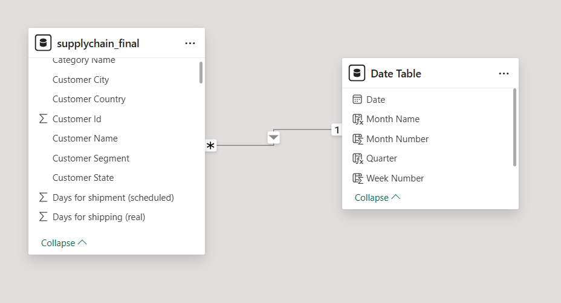

> Date Table created in DAX and linked to `order date` column for all time intelligence measures.

---

### Page 1 — Executive Summary
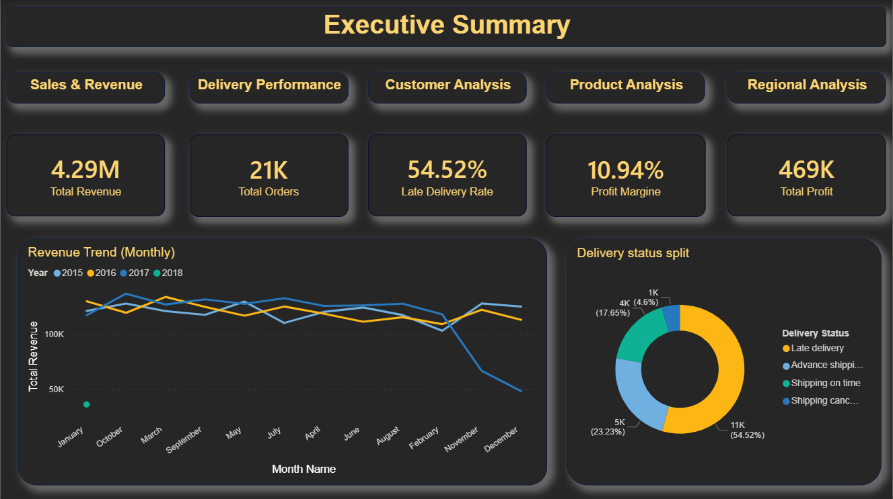

**KPIs:** Total Revenue ($4.29M) · Total Orders (21K) · Late Delivery Rate (54.52%) · Profit Margin (10.94%) · Total Profit (469K)

**Visuals:**
- Revenue Trend (Monthly) — line chart by year (2015–2018)
- Delivery Status Split — donut chart showing Late/On time/Advance/Canceled breakdown

---

### Page 2 — Sales & Revenue
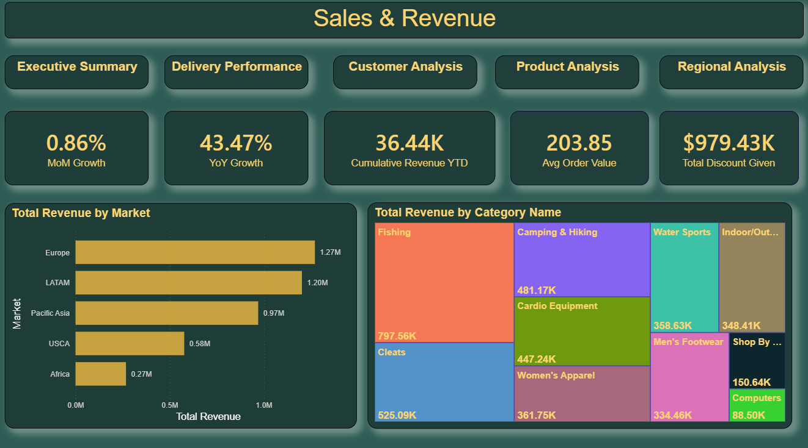

**KPIs:** MoM Growth (0.86%) · YoY Growth (43.47%) · Cumulative Revenue YTD (36.44K) · Avg Order Value ($203.85) · Total Discount Given ($979.43K)

**Visuals:**
- Total Revenue by Market — bar chart (Europe leads at $1.27M)
- Total Revenue by Category Name — treemap (Fishing dominates at $797.56K)

---

### Page 3 — Delivery Performance
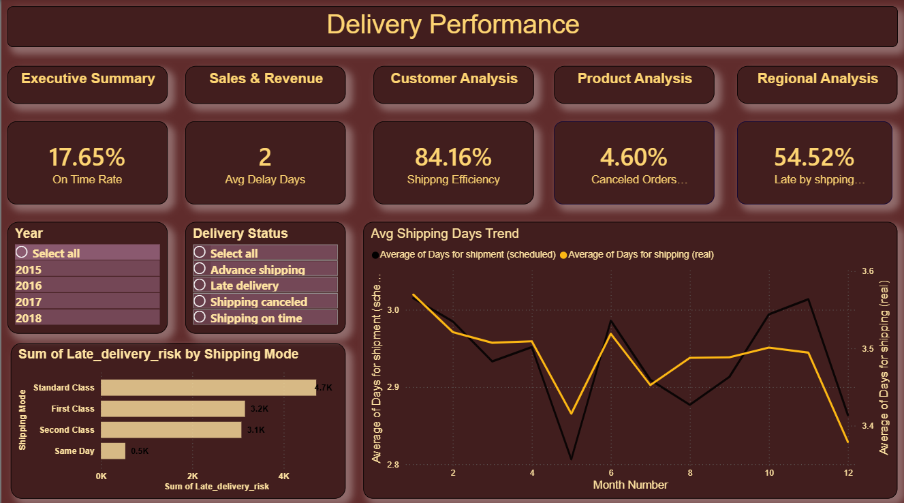

**KPIs:** On Time Rate (17.65%) · Avg Delay Days (2) · Shipping Efficiency (84.16%) · Canceled Orders (4.60%) · Late by Shipping Mode (54.52%)

**Visuals:**
- Late Delivery Risk by Shipping Mode — bar chart (Standard Class highest at 4.7K)
- Avg Shipping Days Trend — dual line chart comparing actual vs scheduled days by month

**Slicers:** Year · Delivery Status

---

### Page 4 — Customer Analysis
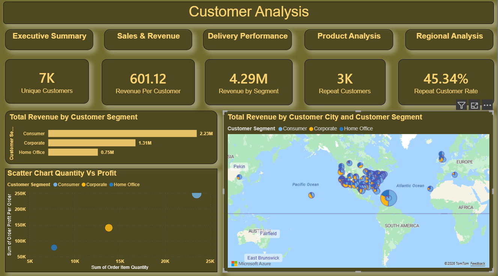

**KPIs:** Unique Customers (7K) · Revenue per Customer ($601.12) · Revenue by Segment ($4.29M) · Repeat Customers (3K) · Repeat Customer Rate (45.34%)

**Visuals:**
- Revenue by Customer Segment — bar chart (Consumer $2.23M, Corporate $1.31M, Home Office $0.75M)
- Revenue by Customer City and Segment — world map with bubble size by revenue
- Scatter Chart — Order Item Quantity vs Order Profit Per Order by segment

---

### Page 5 — Product Analysis
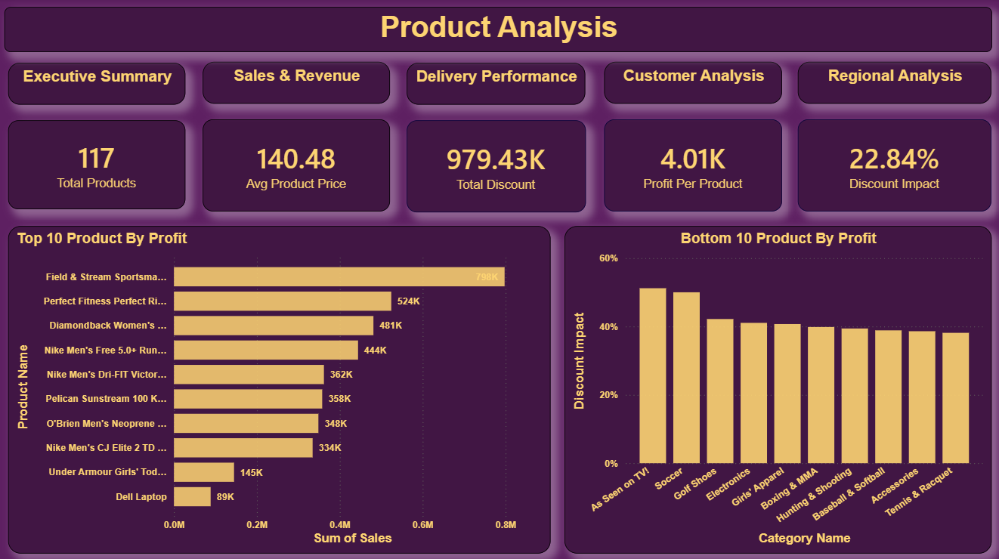

**KPIs:** Total Products (117) · Avg Product Price ($140.48) · Total Discount ($979.43K) · Profit per Product ($4.01K) · Discount Impact (22.84%)

**Visuals:**
- Top 10 Products by Profit — bar chart (Field & Stream Sportsman leads at $798K)
- Bottom 10 Categories by Discount Impact — bar chart (As Seen on TV, Soccer highest impact)

---

### Page 6 — Regional Analysis
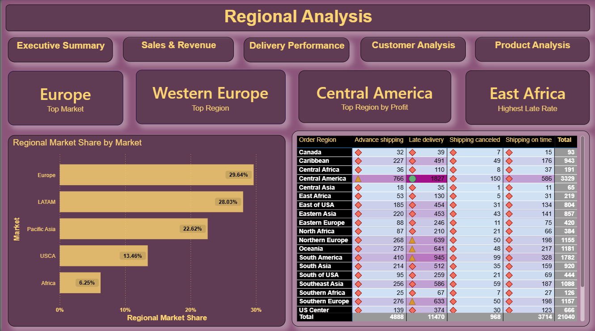

**KPIs:** Top Market (Europe) · Top Region (Western Europe) · Top Region by Profit (Central America) · Highest Late Rate (East Africa)

**Visuals:**
- Regional Market Share by Market — bar chart (Europe 29.64%, LATAM 28.03%, Pacific Asia 22.62%)
- Order Region vs Delivery Status — matrix table with conditional formatting (Central America highest volume at 3,329 total orders)

---

## Key DAX Measures

```dax
-- Revenue
Total Revenue =
SUM(supplychain_final[Sales])

-- Time intelligence
YoY Growth =
DIVIDE(
    [Total Revenue] - CALCULATE([Total Revenue], SAMEPERIODLASTYEAR('Date Table'[Date])),
    CALCULATE([Total Revenue], SAMEPERIODLASTYEAR('Date Table'[Date]))
)

MoM Growth =
DIVIDE(
    [Total Revenue] - CALCULATE([Total Revenue], DATEADD('Date Table'[Date], -1, MONTH)),
    CALCULATE([Total Revenue], DATEADD('Date Table'[Date], -1, MONTH))
)

Cumulative Revenue YTD =
CALCULATE([Total Revenue], DATESYTD('Date Table'[Date]))

-- Delivery
Late Delivery Rate =
DIVIDE(
    COUNTROWS(FILTER(supplychain_final, supplychain_final[Delivery Status] = "Late delivery")),
    COUNTROWS(supplychain_final)
)

On Time Rate =
DIVIDE(
    COUNTROWS(FILTER(supplychain_final, supplychain_final[Delivery Status] = "Shipping on time")),
    COUNTROWS(supplychain_final)
)

Shipping Efficiency =
DIVIDE(
    AVERAGE(supplychain_final[Days for shipment (scheduled)]),
    AVERAGE(supplychain_final[Days for shipping (real)])
)

Avg Delay Days =
AVERAGEX(
    FILTER(supplychain_final, supplychain_final[Delivery Status] = "Late delivery"),
    supplychain_final[Days for shipping (real)] - supplychain_final[Days for shipment (scheduled)]
)

-- Customer
Unique Customers =
DISTINCTCOUNT(supplychain_final[Customer Name])

Revenue per Customer =
DIVIDE([Total Revenue], [Unique Customers])

Customer Lifetime Value =
AVERAGEX(
    VALUES(supplychain_final[Customer Name]),
    CALCULATE(SUM(supplychain_final[Sales]))
)

Repeat Customers =
COUNTROWS(
    FILTER(
        VALUES(supplychain_final[Customer Name]),
        CALCULATE(COUNTROWS(supplychain_final)) > 1
    )
)

-- Product
Total Discount =
SUMX(
    supplychain_final,
    supplychain_final[Order Item Quantity] * supplychain_final[Order Item Discount]
)

Discount Impact =
DIVIDE([Total Discount], [Total Revenue])

Profit per Product =
DIVIDE([Total Profit], DISTINCTCOUNT(supplychain_final[Product Name]))

-- Regional
Regional Market Share =
DIVIDE(
    CALCULATE([Total Revenue], ALLEXCEPT(supplychain_final, supplychain_final[Market])),
    CALCULATE([Total Revenue], ALL(supplychain_final))
)
```

---

## Key Insights

- **54.52%** of all orders are delivered late — a critical logistics issue requiring immediate attention
- **Europe** (29.64%) and **LATAM** (28.03%) together account for over 57% of total revenue
- **Fishing** ($797.56K) and **Cleats** ($525.09K) are the top revenue-generating categories
- **Standard Class** shipping has the highest late delivery risk (4.7K incidents)
- **Consumer** segment drives 52% of total revenue ($2.23M)
- **Central America** is both the highest volume region (3,329 orders) and top region by profit
- **East Africa** has the highest late delivery rate among all regions
- **Field & Stream Sportsman** is the top product by profit ($798K)
- Only **17.65%** of orders ship on time — significant supply chain optimization opportunity

---

## Project Structure

```
ChainForge/
├── README.md
├── python/
│   ├── corrupt_data.py              ← data corruption & split script
│   └── requirements.txt
├── adf/
│   ├── pipelines/
│   │   └── PL_SupplyChain_Master.json
│   ├── datasets/
│   │   ├── DS_Binary.json
│   │   ├── DS_CSV.json
│   │   ├── DS_Parquet.json
│   │   ├── DS_Avro.json
│   │   └── DS_JSON.json
│   ├── dataflows/
│   │   └── DF_SupplyChain.json
│   └── linkedServices/
│       └── LS_ADLS.json
├── data/
│   └── sample_data.csv              ← first 500 rows only
├── screenshots/
│   ├── adls_containers.png
│   ├── adls_container_folders.png
│   ├── adls_raw.png
│   ├── adls_processed.png
│   ├── adls_output.png
│   ├── pipeline_run.png
│   ├── dataflow.png
│   ├── powerbi_model.png
│   ├── executive_summary.png
│   ├── sales_revenue.png
│   ├── delivery_performance.png
│   ├── customer_analysis.png
│   ├── product_analysis.png
│   └── regional_analysis.png
└── powerbi/
    └── supplychain_report.pbix
```

---

## Setup & Reproduction

### Prerequisites
```
- Azure subscription
- Azure Storage Account with Data Lake Gen2 (hierarchical namespace) enabled
- Azure Data Factory instance
- Power BI account (app.powerbi.com — free)
- Python 3.x
```

### Python dependencies
```bash
pip install pandas pyarrow pandavro
```

### Steps

```
1. Upload raw files to ADLS:
   sourcesupplychaindataset/raw/
   → supplychain_2015.csv
   → supplychain_2016.parquet
   → supplychain_2017.avro
   → supplychain_2018.json

2. Create ADF Linked Service pointing to supplychainstorageadf

3. Import pipeline from adf/pipelines/PL_SupplyChain_Master.json

4. Update connection strings in Linked Service

5. Run pipeline → PL_SupplyChain_Master
   Expected duration: ~3-4 minutes total

6. Verify output:
   sourcesupplychaindataset/output/supplychain_final.csv (7.36 MiB)

7. Connect Power BI:
   Get Data → Azure Data Lake Storage Gen2
   URL: https://supplychainstorageadf.dfs.core.windows.net
   Navigate to: sourcesupplychaindataset/output/supplychain_final.csv

8. Create Date Table in Power BI:
   Date Table = CALENDAR(MIN(...[order date]), MAX(...[order date]))

9. Link Date Table to order date column in Model view

10. Add DAX measures and build 6-page dashboard
```

---

## Author

**Bhoomi**
Data Analyst | Azure | Power BI | Python
[GitHub](https://github.com/bhooomyy) · [LinkedIn](https://www.linkedin.com/in/bhatt-bhoomi/) · [Website](https://bhooomyy.github.io)
